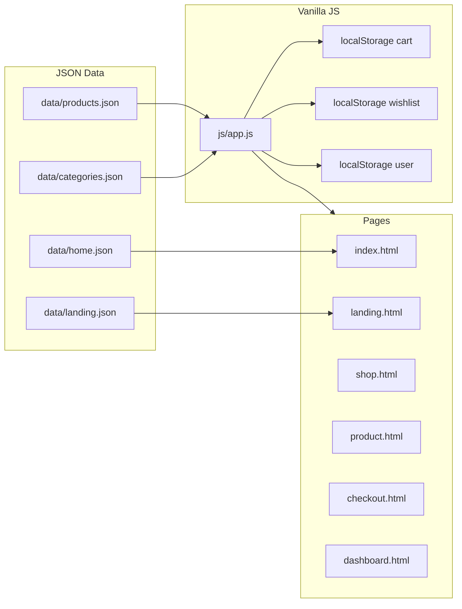

# پلن فروشگاه صنعتی MahradCNC

## هویت برند و جهت بصری

- **برند:** MahradCNC (لوگو موجود در [`img/icon.png`](img/icon.png) و [`img/icon2.png`](img/icon2.png))
- **مخاطب:** خریداران B2B/تکنسین‌های CNC — جستجو با مدل فنی (مثل HGH45CA)، مشخصات، موجودی
- **الهام ساختاری از** [shop.cncparts.ir](https://shop.cncparts.ir/): دسته‌بندی مکانیکی/الکترونیکی، جدیدترین‌ها، پرفروش‌ها، تماس سریع — بدون کپی UI شلوغ؛ لایه‌بندی تمیزتر و صنعتی‌تر
- **تصاویر محصول:** [`img/1.png`](img/1.png) تا [`img/38.png`](img/38.png) — بک‌گراند تیره فلزی؛ UI باید با نارنجی/بنفش روی کارت سفید کنتراست بدهد
- **قوانین اجرایی:** الگوهای [`promt.md`](promt.md) (بدون هاردکد، Mobile-First، Semantic/ARIA، کارت یکپارچه، changelog) + قوانین الزامی [`tailwind-v4-best-practices.md`](tailwind-v4-best-practices.md) (CDN، `@theme`، بدون `@apply`، بدون hex در کلاس)
- **الگوی معماری:** مشابه [`tw-task/`](tw-task/) — `app.js` مشترک + JS صفحه‌ای + داده جدا — ولی **بدون Vite** (طبق سند CDN)

---

## UIKit — سیستم دیزاین (منبع حقیقت)

### پالت رنگی (Industrial Orange + Purple + White)

| نقش              | توکن                    | مقدار پیشنهادی                | کاربرد                                         |
| ---------------- | ----------------------- | ----------------------------- | ---------------------------------------------- |
| Primary          | `--color-primary`       | `#E85D04`                     | CTA اصلی، افزودن به سبد، اکسنت هدر             |
| Primary hover    | `--color-primary-hover` | `#D00000` متمایل به `#C2410C` | hover دکمه‌ها                                  |
| Primary soft     | `--color-primary-soft`  | `#FFF4ED`                     | badge تخفیف، پس‌زمینه ملایم                    |
| Accent           | `--color-accent`        | `#6D28D9`                     | لینک‌های ثانویه، تب فعال داشبورد، هایلایت دسته |
| Accent soft      | `--color-accent-soft`   | `#F5F3FF`                     | پس‌زمینه بخش‌های بنفش ملایم                    |
| Surface          | `--color-bg-primary`    | `#FFFFFF`                     | کارت، هدر                                      |
| Page             | `--color-bg-secondary`  | `#F8F7FC`                     | پس‌زمینه صفحه (سفید با ته بنفش خیلی کم)        |
| Ink              | `--color-text-primary`  | `#1A1A2E`                     | متن اصلی                                       |
| Muted            | `--color-text-muted`    | `#6B7280`                     | مشخصات فرعی                                    |
| Border           | `--color-border-light`  | `#E8E5F0`                     | خط کارت                                        |
| Success / Danger | استاندارد سبز/قرمز      | موجودی / خطا                  |

**قانون ترکیب:** نارنجی = اکشن خرید؛ بنفش = ناوبری/هویت ثانویه؛ سفید = سطح محتوا. لوگو فعلی آبی است — در UI از همان فایل استفاده می‌شود؛ اکسنت‌های صفحه نارنجی/بنفش می‌مانند (بدون ری‌کالر اجباری فایل PNG در فاز اول).

### تایپوگرافی

- فونت سراسری: **Sahel** (همه تگ‌های متنی؛ Font Awesome مستثنا)
- سلسله‌مراتب مطابق سند best-practices: `h1 text-3xl` → `h2 text-2xl` → کارت `h3 text-xl` → body `text-base`

### شعاع و سایه (صنعتی، نه پاستلی)

- Radius نسبتاً جمع‌وجور: `sm 6` / `md 8` / `lg 10` / `xl 12` / `2xl 16` (نه خیلی گرد)
- سایه کارت: کم‌عمق صنعتی (`shadow-sm` / `shadow-md`)
- بدون glow بنفش، بدون pill افراطی

### کامپوننت‌های ثابت UIKit (مجموعه utility یکسان در همه صفحات)

1. **Button Primary / Secondary / Accent / Ghost / Icon(+ موبایل)**
2. **ProductCard** — تصویر، نام، کد مدل، قیمت تومان، badge موجودی/تخفیف، wishlist، افزودن سبد (موبایل فقط آیکن `+`)
3. **CategoryCard** — آیکن/تصویر + عنوان + تعداد
4. **Badge** — موجود / ناموجود / تخفیف / پرفروش
5. **Input / Select / Search** — focus با `shadow-focus` نارنجی کم‌رنگ
6. **Header** — لوگو، جستجو، دسته‌ها، سبد (دسکتاپ)؛ موبایل بدون سبد در هدر + **bottom-nav**
7. **Footer** — تماس، دسته‌های اصلی، شبکه‌های اجتماعی
8. **SectionHeader** — عنوان + لینک «مشاهده همه»
9. **EmptyState / Toast / Modal** — سبد خالی، تأیید سفارش

صفحه مرجع زنده: [`uikit.html`](uikit.html) — همه کامپوننت‌ها کنار هم برای کنترل یکپارچگی.

---

## معماری فنی



**استک قطعی:** HTML RTL (`lang="fa" dir="rtl"`) + Tailwind v4 CDN (`https://c7n.ir/css/tailwind/v4.2/tailwind.js`) + Vanilla JS + JSON + `localStorage` برای سبد/علاقه‌مندی/نشست کاربر.

**داده بدون هاردکد:** محصولات، دسته‌ها، سکشن‌های خانه و لندینگ فقط از JSON؛ رندر کارت‌ها با یک تابع مشترک `renderProductCard(product)`.

---

## ساختار پوشه‌ها

```
mahradcnc1/
├── index.html              # صفحه اصلی فروشگاهی
├── landing.html            # لندینگ کمپین/معرفی برند
├── shop.html               # کاتالوگ + فیلتر
├── product.html            # جزئیات محصول (PDP — لازم برای خرید)
├── checkout.html           # سبد + تسویه (صفحه خرید)
├── dashboard.html          # داشبورد کاربر
├── uikit.html              # مرجع UIKit
├── css/
│   └── theme.css           # مستند توکن‌ها + keyframes مجاز
├── js/
│   ├── app.js              # loadJSON، formatPrice، storage، header/footer، card
│   ├── home.js
│   ├── landing.js
│   ├── shop.js
│   ├── product.js
│   ├── checkout.js
│   └── dashboard.js
├── data/
│   ├── products.json       # ~24–38 محصول از img/
│   ├── categories.json     # مکانیکی، الکترونیکی، جانبی، وکیوم
│   ├── home.json           # hero، stories/اسلایدر، بخش‌ها
│   └── landing.json        # CTA، ویژگی‌ها، آمار اعتماد
├── img/                    # موجود — بدون جابجایی اجباری
├── changelog.md
└── project_status.md
```

> `product.html` صفحه ششم پشتیبانی است؛ بدون آن جریان «فروشگاه → خرید» ناقص می‌ماند. در ناوبری اصلی ۵ صفحه درخواستی شما دیده می‌شود.

---

## مدل داده JSON (خلاصه)

```json
{
  "id": "p-hgh45",
  "slug": "rail-wagon-hgh45ca",
  "name": "واگن و ریل خطی HGH45CA",
  "sku": "HGH45CA-2006-00100",
  "categoryId": "mechanical-rail",
  "price": 4250000,
  "compareAtPrice": null,
  "stock": 12,
  "image": "img/1.png",
  "badges": ["bestseller"],
  "specs": { "series": "HGH", "size": "45" },
  "shortDesc": "...",
  "description": "..."
}
```

ذخیره کلاینت:

- `mahrad_cart` — `{ productId, qty }[]`
- `mahrad_wishlist` — `productId[]`
- `mahrad_user` — پروفایل نمونه + سفارش‌های ساختگی
- `mahrad_orders` — بعد از ثبت خرید در checkout

---

## چیدمان صفحات

### 1) `index.html` — صفحه اصلی (یک ترکیب، نه داشبورد)

Hero full-bleed با تصویر صنعتی + برند MahradCNC غالب + یک جمله + گروه CTA (فروشگاه / مشاوره) — بدون استات/پروموی شلوغ در viewport اول.

سپس به‌ترتیب:

- دسته‌های اصلی (از JSON)
- جدیدترین محصولات
- پرفروش‌ها
- نوار اعتماد (ارسال/اصالت/پشتیبانی) — **زیر fold**
- فوتر تماس

### 2) `landing.html` — لندینگ کمپین

صفحه مستقل بازاریابی: hero برند + ارزش پیشنهادی + ۳ مزیت + CTA به فروشگاه + نمونه محصولات منتخب از JSON. بدون سبد پیچیده؛ تمرکز تبدیل.

### 3) `shop.html` — فروشگاه

فیلتر دسته/جستجو/مرتب‌سازی + گرید ProductCard. موبایل: فیلتر در drawer. دسکتاپ: سایدبار دسته.

### 4) `product.html` — PDP

گالری، عنوان، SKU، قیمت، مشخصات فنی جدول‌وار، افزودن سبد، محصولات مرتبط (همان کامپوننت کارت).

### 5) `checkout.html` — صفحه خرید

لیست سبد، تغییر تعداد، خلاصه مبلغ، فرم آدرس/تماس، ثبت سفارش → نوشتن در `localStorage` + toast موفقیت.

### 6) `dashboard.html` — داشبورد کاربر

تب‌ها با اکسنت بنفش: پروفایل، سفارش‌ها، **Wishlist با کارت کامل محصول** (الزام [`promt.md`](promt.md)), آدرس‌ها. هدر ساده‌تر از صفحات public.

---

## فازهای اجرا

| فاز                | خروجی                                                                              |
| ------------------ | ---------------------------------------------------------------------------------- |
| **0 — Foundation** | ساختار پوشه، `theme`/`@theme` نارنجی-بنفش، Sahel + FA، `app.js` پایه، `uikit.html` |
| **1 — Data**       | `products.json` + `categories.json` با map به `img/*.png`، helpers قیمت/موجودی     |
| **2 — Shell**      | Header/Footer/Bottom-nav مشترک؛ لینک‌های auth                                      |
| **3 — Home**       | `index.html` + `home.js` سکشن‌ها از JSON                                           |
| **4 — Shop + PDP** | فیلتر، گرید، جزئیات، سبد/wishlist                                                  |
| **5 — Checkout**   | سبد کامل + ثبت سفارش                                                               |
| **6 — Landing**    | `landing.html` کمپین                                                               |
| **7 — Dashboard**  | پروفایل، سفارش، wishlist کارت کامل                                                 |
| **8 — Polish**     | ریسپانسیو، ARIA، empty states، `changelog.md` + `project_status.md`                |

---

## اصول UX جهانی که رعایت می‌شود

- Mobile-first؛ bottom-nav در موبایل؛ سبد در هدر فقط `lg+`
- مسیر خرید کوتاه: کارت → PDP → سبد → ثبت
- قیمت و SKU همیشه خوانا؛ فیلتر دسته برای کاتالوگ صنعتی
- دسترسی‌پذیری: label، focus visible، `aria-label` روی آیکن‌ها
- یک ProductCard در همه سطوح — تغییر یک‌بار، اعمال همه‌جا

---

## خارج از محدوده این پلن

- درگاه پرداخت واقعی / بک‌اند سرور
- پنل ادمین
- ری‌دیزاین فایل لوگو PNG
